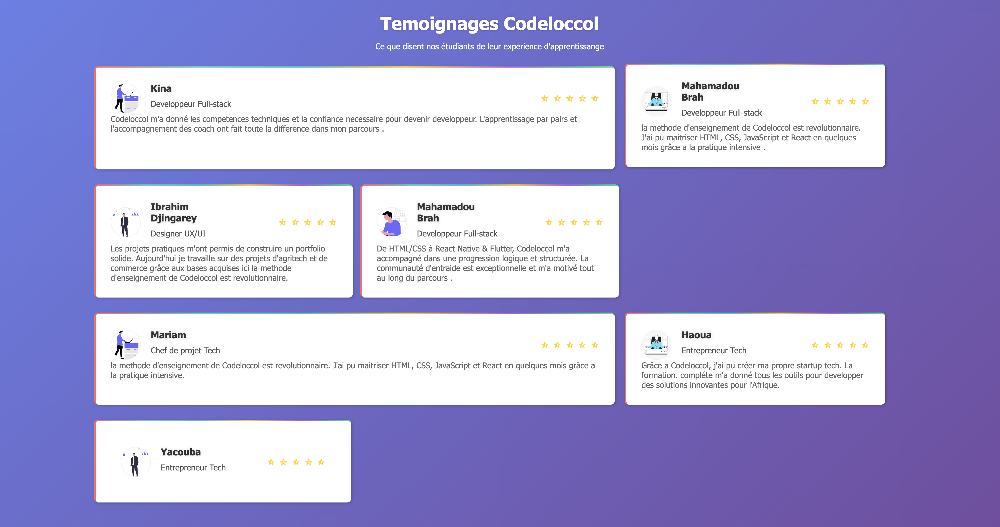
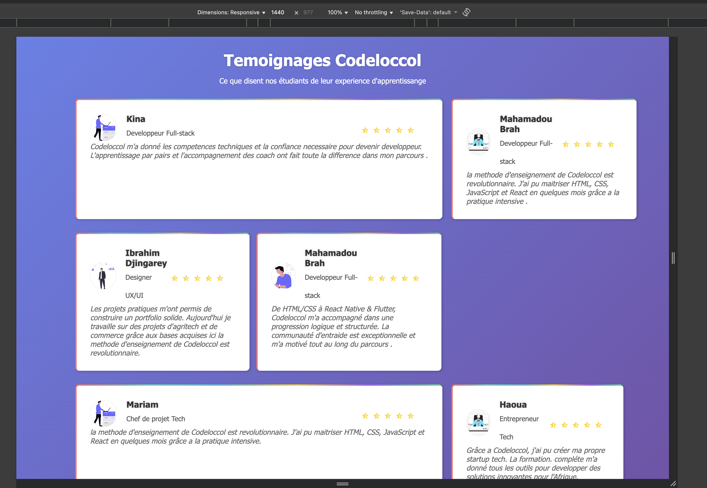
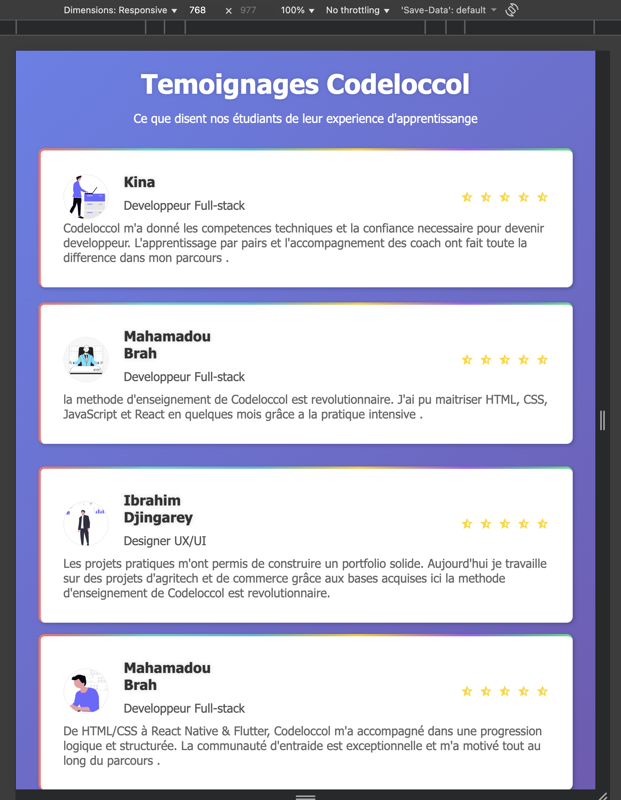
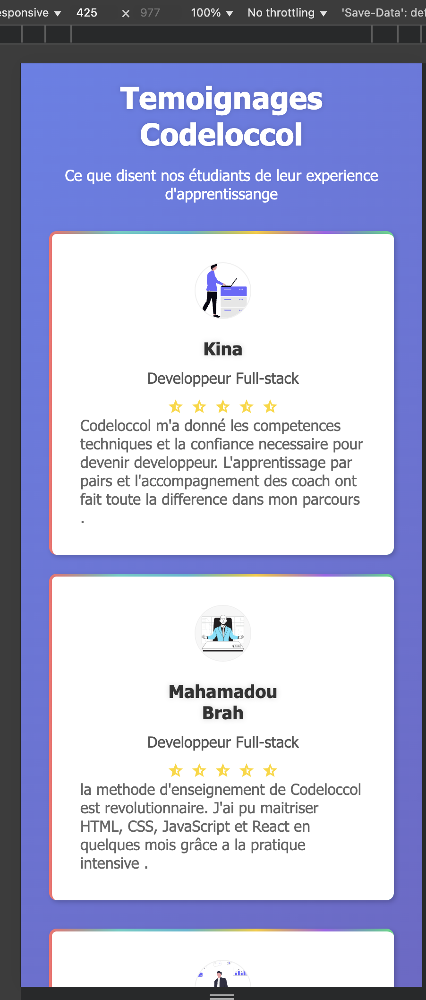
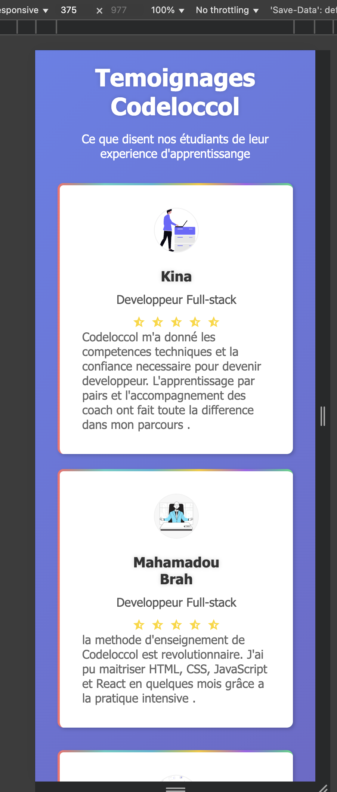
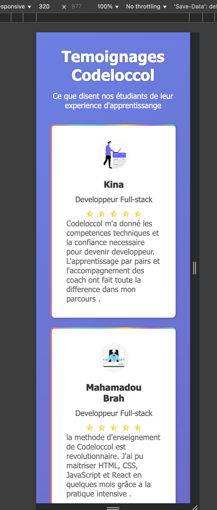

# Testimonials Page Codeloccol

# Objectif du projet
Créer une interface attrayante et responsive affichant une grille de témoignages d’apprenants, afin de pratiquer la structuration HTML, la mise en page CSS, et la responsivité.

Une page web moderne et responsive présentant les témoignages d’étudiants de Codeloccol.  
Ce projet met en avant une fois de plus les compétences en HTML et CSS.

##  Technologies utilisées

**HTML Structure sémantique de la page et organisation du contenu** 
**CSS Mise en page, design responsive et animations**
**Google Fonts** 
**Remix Icons**

## Responsive Design
 Desktop 1440px  Grille à plusieurs colonnes 
 Tablette 768px  Grille réorganisée verticalement 
 Mobile 375px  Cartes empilées et texte centré 

 ## Remarques 
Ce projet m’a permis de renforcer mes bases en HTML et CSS tout en decouvrant une autre maniere qui facile la responsivité .  
C’est un exercice motivant qui m’a donné envie d’aller encore plus loin en développement web.

 ## pour les captures d'ecrans:
### pour le desktop

### a 1440px

### pour les tablettes

### pour les mobiles

